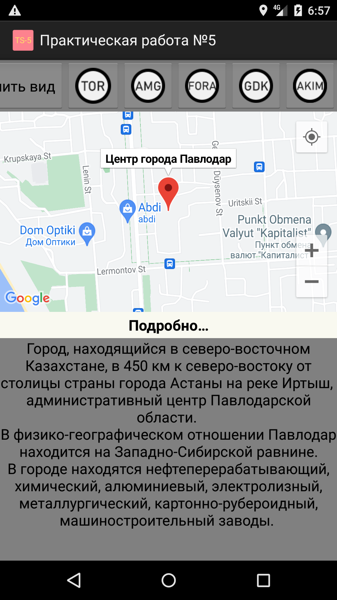
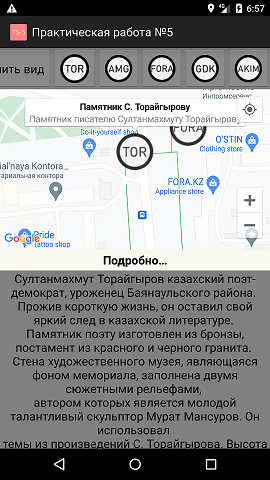
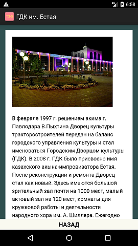
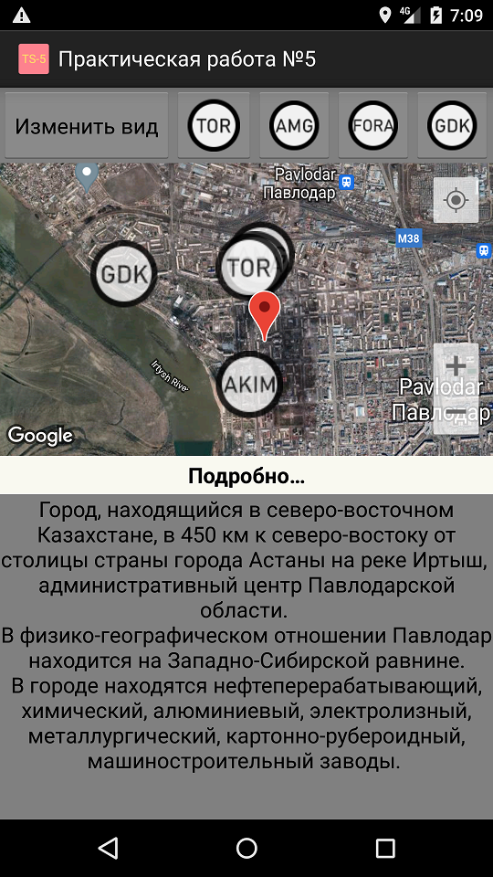

  
Центр города.  
В нижней части экрана, находится информация.  
  
При нажатие на метку, переносит к ней, и снизу показывает так же информацию.  
   
При нажатие кнопки "Изменить вид", изменяет тип карты.  
  
При нажатие кнопки "Подробнее", показывает всю информацию метки.  

