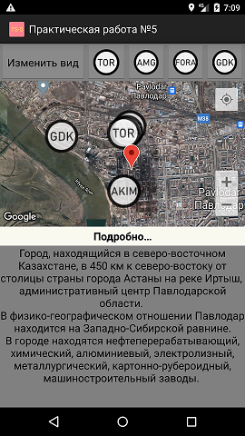
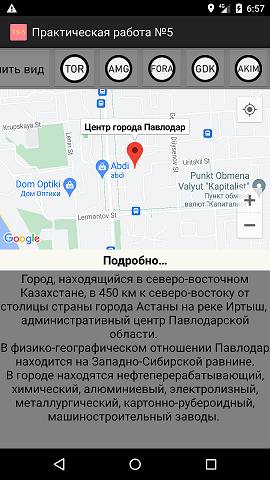
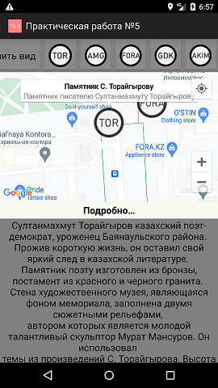
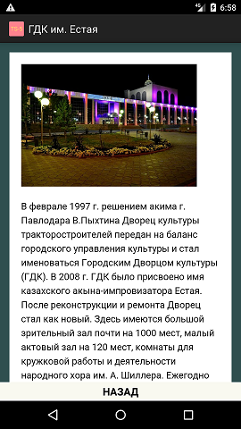

  
Центр города.  
Информация о выбранной точке находится в нижней части экрана.  
  
При нажатии на метку, вид переходит к ней, снизу открывается информация о ней.  
   
Кнопка "Изменить вид" меняет тип карты. 
  
Кнопка "Подробнее" открывает отдельное окно с более подробной информацией о метке. 
